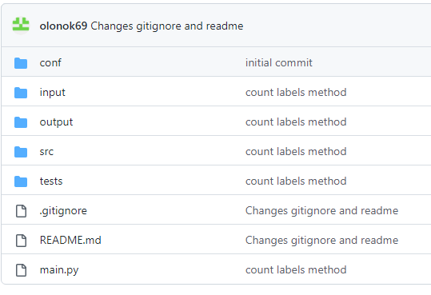
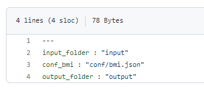
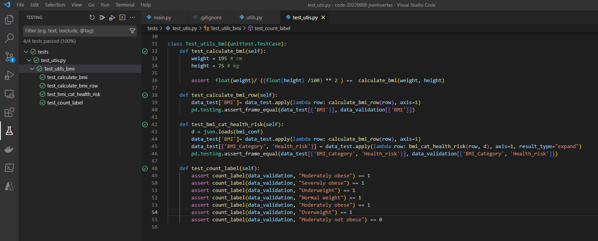

# code-20220608-juanhuertas
Python BMI Calculator Offline Coding Challenge V7

**Problem Statement** 

Given the following JSON data
[{"Gender": "Male", "HeightCm": 171, "WeightKg": 96 },
{ "Gender": "Male", "HeightCm": 161, "WeightKg": 85 },
{ "Gender": "Male", "HeightCm": 180, "WeightKg": 77 },
{ "Gender": "Female", "HeightCm": 166, "WeightKg": 62},
{"Gender": "Female", "HeightCm": 150, "WeightKg": 70},
{"Gender": "Female", "HeightCm": 167, "WeightKg": 82}]
as the input with weight and height parameters of a person, we have to perform the following:
1) Calculate the BMI (Body Mass Index) using FormUla 1, BMI Category and Health risk
from Table 1 of the person and add them as 3 new columns
2) Count the total number of overweight people using ranges in the column BMI Category
of Table 1, check this is consistent programmatically and add any other observations in
the documentation
3) Create build, tests to make sure the code is working as expected and this can later be
added to an automation build / testing / deployment pipeline
4) Write a solid production-grade Python3 Program to solve this problem, imagine this will
be used in-product for 1 million patients. We are only interested in a standalone
backend application, we are NOT expecting a UI, webpage, frontend, Mobile App,
microsite, docker, web app etc. Simple and clean solution. Feel free to explore and use
the standard Python libraries or any open source Python modules
5) Check in the documentation, configuration, code and tests into github and please email
us the link with the URL pattern
https://www.github.com/<owner>/code-<date>-<your fullname> and do NOT
use Vamstar in URL, title or description. e.g. for me it could be
https://www.github.com/richard/code-20200917-richardfreeman

**Formula 1 - BMI**

**BMI(kg/m2) = mass(kg) / height(m)2**

The BMI (Body Mass Index) in (kg/m2
) is equal to the weight in kilograms (kg) divided by your
height in meters squared (m)2
. For example, if you are 175cm (1.75m) in height and 75kg in
weight, you can calculate your BMI as follows: 75kg / (1.75m²) = 24.49kg/m²

**Program skeleton**

- The entry point script is main.py which expect to receive a mandatory parameter "conf_file" whit the path of the 
configuration yaml file Ex: python .\main.py --conf_file ./conf/conf.yaml
- conf folder: contains the configuration yaml file and bmi categories, bmi ranges and health risk categories in two 
formats json and csv. We use json in this version
- images: just contains the images illustrating this Readme.md file
- input folder: contains the input json file/s
- src folder: contains python scripts with support methods and functions use in main
- test folder: contains unittest scripts

**conf.yaml file**

Just contains keys to identify input data folder, output data folder and the bmi configuration file
The application expect to read file/s from folder in key input_folder and it will produce an output in json on folder 
configured in key output_folder. The Application it will iterate through all the json files in input folder

**Test**
Tests are design to be run either inside a conventional IDE or as part of a CI/CD pipeline using standard notation

ex: VScode

**Additional comments**
To scalate this solution to million clients we can follow different approaches, depending how we ingest the input data
assuming that my input is a folder on a data lake where we receive individual json files containing multiples samples each,
we can:
- Read all of them and feed a single dataframe, them use a technology like Dask to apply the transformations to n chunks
of this dataframe, where n is the number or cpu,s available. Output a single file
- Read all the file paths into a list, divide the list in n chunks ,use multiprocessing library and send to n 
simultaneous process, each transforming a chunk. n here as well is the number of cpu of your server/computer and we 
output a file per input file
- if we have cloud resources available other solutions like Databricks can be use as well as part of the ingestion pipeline

The method which calculate the numbers of "Overweight", is a generic method which return you just exact matches to the label 
you send to the method, not doing any king of grouping or assumption like "Moderate obese" is overweight or not. 

